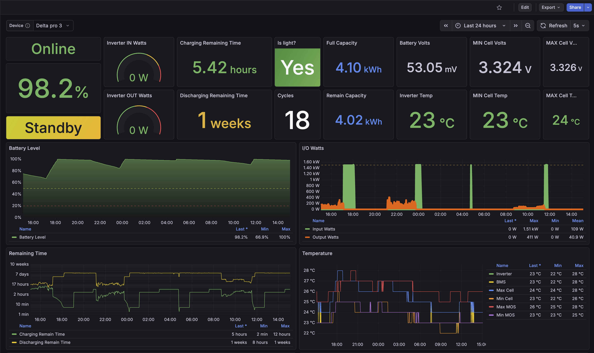
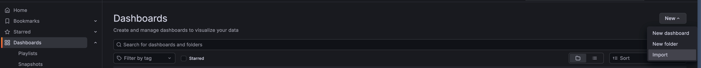
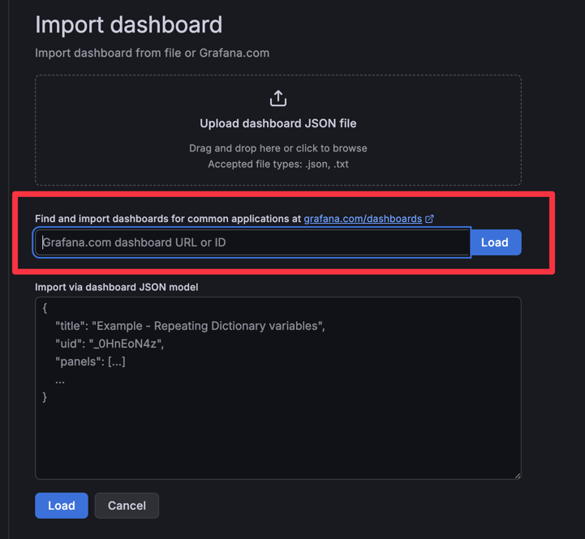
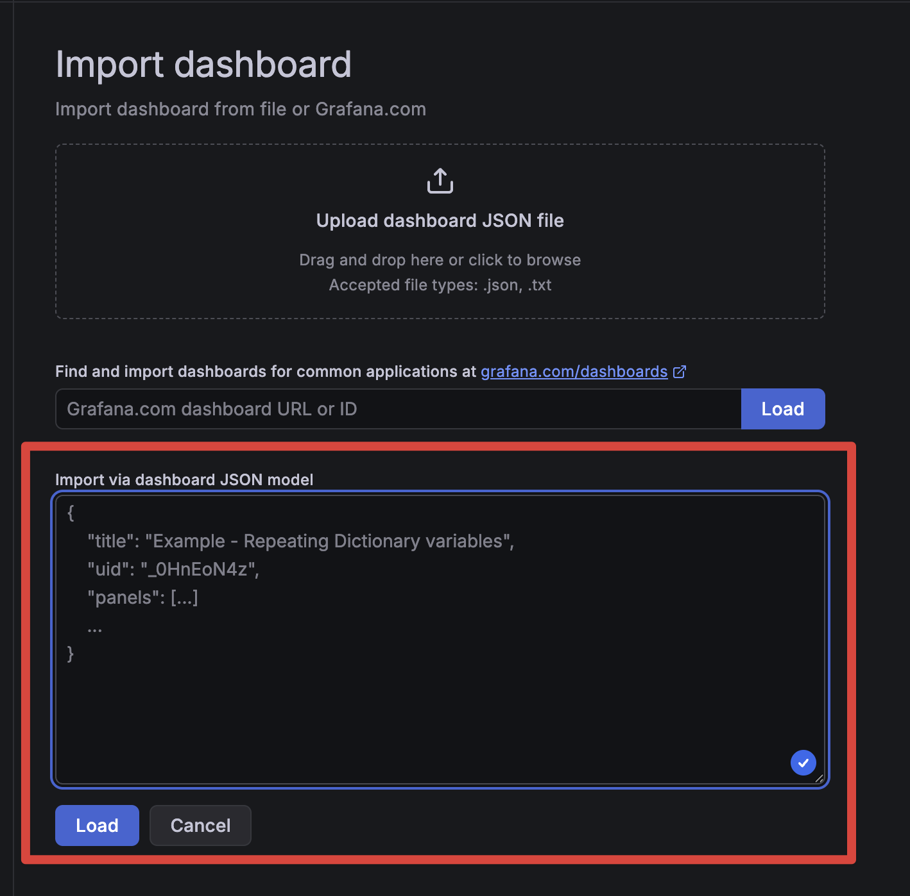
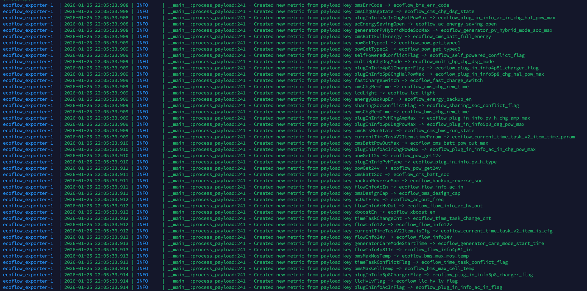
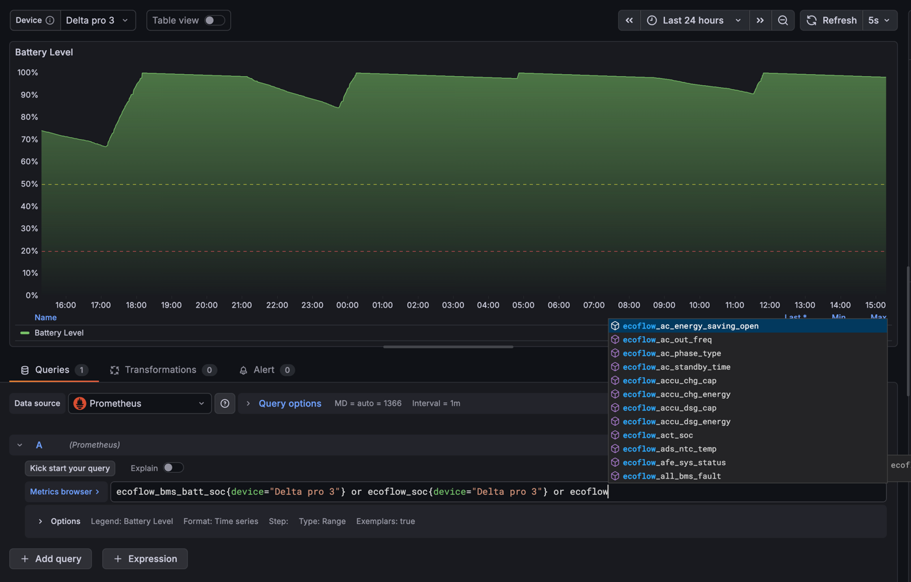

# EcoFlow Metric Manager

## WARNING!

The project is under development. There may be some issues or bugs.  
Project based on [EcoFlow to Prometheus exporter](https://github.com/berezhinskiy/ecoflow_exporter/tree/master) by
Yaroslav Berezhinskiy.  
The project, for now, supports only one device at a time.

The system has been tested only on Delta Pro 3. Many older devices may be unsupported.  
In theory, devices from the
[official documentation](https://developer-eu.ecoflow.com/us/document/generalInfo) are fully supported.
Other devices need to be tested.  
It is expected that the user is already familiar with Prometheus and Grafana,
Python and Docker and understands what an API is, etc.
EcoFlow sends different metric names for different device models,
so you may need to tune dashboards for your own model.

## Requirements

1. Python 3.11+
2. Already registered EcoFlow developer account
3. docker-compose
4. Knowledge of NGINX (optional)

## Installation Guide

1. Set up all required credentials in [.env](.env_example) file
2. Run `docker-compose up -d`
3. Run `docker-compose logs -f` to see logs
4. After you see that all containers are up, go to Grafana and import dashboards  
   You can load dashboards in two ways:

- Import from Grafana by ID 
  
- Import from [dashboard.json](dashboard.json)
  
- After loading dashboards, you can see metrics in Grafana.

## If You Don't See Any Metrics in Grafana After Importing Dashboards

You can see logs in `docker-compose logs -f` and check what metrics your device receives from EcoFlow API.

In the example, you can see what metrics the exporter registers from the EcoFlow API.  
`<apiMetricName> -> <prometheus\grafana_metric_name>`  
After this, you can tune your dashboards to see metrics in Grafana.
  
Some metrics can be registered multiple times under different names.   
This is because the exporter uses two APIs at the same time:  
the official API and the internal Android app API with additional metrics.  
They deliver many different metrics. The Android API has more detailed metrics for some devices, but at the same time, it is quite unstable.
The system has reconnection to both APIs within 30 seconds after detecting that one of them is down.  
Reconnection is common for the Android API because it can be closed if you use mobile (Android/iOS) to view or
change some settings on your device.

## Alerting

The system has an Alertmanager that uses the Prometheus API to send alerts to Telegram.  
You can tune conditions to your needs in the [ecoflow.yml](prometheus/alerts/ecoflow.yml) file.

## NGINX Proxy Manager

This container is optional. It is added for people who want to use HTTPS with a domain name.  
If you don't need it, you can remove it from docker-compose.yml.

## In Development

I want to migrate from Alertmanager to a custom API that will trigger different actions in different situations.  
For example, change charging power based on the time of day, integration with smart devices like wall sockets, etc.  
It will be added to this project in the future when it is ready.

## License

This project is licensed under the GNU General Public License v3.0 - see the [LICENSE](LICENSE) file.